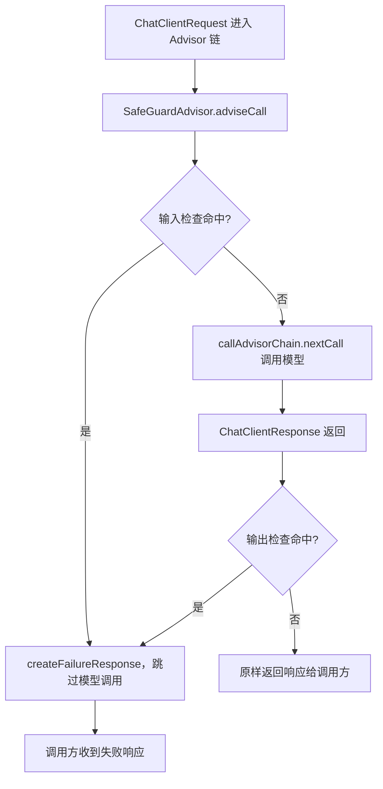
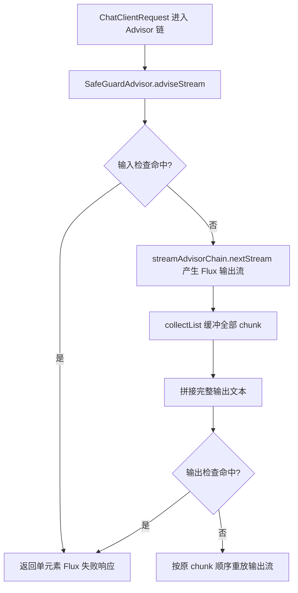

# 敏感词过滤（Sensitive Word Filter）

Feature Name: sensitive-word-filter
Updated: 2026-08-25

## Description

增强 Spring AI 现有 `SafeGuardAdvisor`，在 ChatClient Advisor 链上对模型输入与输出执行敏感词过滤。

- **输入检查（既有能力，保留并默认开启）**：用户输入命中敏感词时，在链入口直接返回失败响应，不调用底层模型。
- **输出检查（新增能力）**：模型响应命中敏感词时，以失败响应替换原始响应并停止回答。
- **匹配策略（新增）**：引入公开的 `SensitiveWordMatcher` 接口，默认实现执行忽略大小写与空白的子串匹配。
- **兼容性**：既有公开构造方法、默认失败响应文本、输入检查默认开启行为均保持不变。

## Architecture

### 非流式（call）执行流程



### 流式（stream）执行流程



### 关键设计决策

1. **流式输出采用"聚合缓冲后判定"**：`collectList` 缓冲全部 chunk 后再判定，保证敏感内容在任何情况下都不会外泄给调用方。代价是失去流式实时性（输出以一次完整交付的形式到达）。这是安全优先的取舍，与需求方确认一致。
2. **输入检查在链入口拦截**：命中后不调用 `nextCall` / `nextStream`，从源头阻止敏感输入进入模型。
3. **输出检查在模型调用完成之后执行**：输出无法在产生前拦截，只能以失败响应替换，语义为"拦截停止回答"。

## Components and Interfaces

### SensitiveWordMatcher（新增接口）

位于 `org.springframework.ai.chat.client.advisor.api` 包，与 `Advisor`、`CallAdvisor` 等公共扩展接口同层，供用户实现自定义匹配策略。

```java
package org.springframework.ai.chat.client.advisor.api;

public interface SensitiveWordMatcher {

	/**
	 * 判定给定文本是否命中任一敏感词。
	 */
	boolean match(String text);

}
```

### DefaultSensitiveWordMatcher（默认实现）

位于 `org.springframework.ai.chat.client.advisor` 包（包内可见，非公共 API）。

- 构造参数：`List<String> sensitiveWords`。
- 匹配规则：对文本与敏感词分别执行 `toLowerCase()` 并移除所有空白后，使用 `contains` 做子串匹配；任一敏感词命中即返回 `true`。
- 空敏感词列表恒返回 `false`（不拦截）。

### SafeGuardAdvisor（增强）

保留既有构造方法 `SafeGuardAdvisor(List<String> sensitiveWords)` 与 `SafeGuardAdvisor(List<String>, String failureResponse, int order)`，二者行为不变。新增 Builder 选项：

| Builder 选项 | 类型 | 默认值 | 说明 |
|---|---|---|---|
| `sensitiveWords` | `List<String>` | 必填 | 敏感词列表，作为默认匹配器输入 |
| `sensitiveWordMatcher` | `SensitiveWordMatcher` | `DefaultSensitiveWordMatcher(sensitiveWords)` | 自定义匹配策略；一旦提供，忽略 `sensitiveWords` |
| `failureResponse` | `String` | `I'm unable to respond...`（既有默认值） | 失败响应文本 |
| `enableInputFilter` | `boolean` | `true` | 启用输入检查 |
| `enableOutputFilter` | `boolean` | `true` | 启用输出检查 |
| `order` | `int` | `0`（既有默认值） | Advisor 链执行顺序 |

#### adviseCall

```java
@Override
public ChatClientResponse adviseCall(ChatClientRequest chatClientRequest, CallAdvisorChain callAdvisorChain) {
	if (this.enableInputFilter && this.matcher.match(chatClientRequest.prompt().getContents())) {
		return createFailureResponse(chatClientRequest);
	}
	ChatClientResponse response = callAdvisorChain.nextCall(chatClientRequest);
	if (this.enableOutputFilter && response != null && this.matcher.match(extractOutputText(response))) {
		return createFailureResponse(chatClientRequest);
	}
	return response;
}
```

#### adviseStream

```java
@Override
public Flux<ChatClientResponse> adviseStream(ChatClientRequest chatClientRequest, StreamAdvisorChain streamAdvisorChain) {
	if (this.enableInputFilter && this.matcher.match(chatClientRequest.prompt().getContents())) {
		return Flux.just(createFailureResponse(chatClientRequest));
	}
	Flux<ChatClientResponse> stream = streamAdvisorChain.nextStream(chatClientRequest);
	if (!this.enableOutputFilter) {
		return stream;
	}
	return stream.collectList().flatMapMany(responses -> {
		String fullText = responses.stream()
			.map(this::extractOutputText)
			.collect(Collectors.joining());
		if (this.matcher.match(fullText)) {
			return Flux.just(createFailureResponse(chatClientRequest));
		}
		return Flux.fromIterable(responses);
	});
}
```

#### 输出文本提取辅助方法

`extractOutputText(ChatClientResponse)` 将响应中所有 `Generation` 的 `AssistantMessage` 文本按序拼接；响应为 `null` 或无 `generation` 时返回空字符串（视为不命中）。

## Data Models

无新增持久化数据模型。敏感词列表与配置通过 Advisor 构造参数/Builders 注入，运行时仅存在于 Advisor 实例内部，不落库。

## Correctness Properties

- **输入命中不调用模型**：输入检查位于链入口，命中即短路，确保敏感输入不进入下游。
- **输出命中不泄露内容**：流式路径先 `collectList` 缓冲完整文本，判定通过后才重放，命中前不会有任何 chunk 提前下发。
- **大小写与空白无关**：默认匹配器忽略大小写与空白，可拦截大小写变形与空格拆分的敏感词。
- **默认匹配行为不变**：不提供自定义匹配器、不改 Builder 选项时，行为与既有 `SafeGuardAdvisor` 一致。
- **空敏感词列表不拦截**：避免误伤所有请求。

## Error Handling

| 场景 | 处理策略 |
|---|---|
| 匹配器执行抛异常 | fail-open：记录告警日志并放行请求，避免匹配器缺陷导致服务不可用 |
| 响应为 `null` 或无 generation | 视为不命中，原样传递 |
| `sensitiveWords` 与 `failureResponse` 为 `null` | 沿用既有 `Assert` 校验，构造期抛出 `IllegalArgumentException` |
| 流式调用提前异常终止 | 由 `collectList` 的 `onError` 通路自然传播，不额外吞掉异常 |

## Test Strategy

### 单元测试：DefaultSensitiveWordMatcherTests

- 大小写不敏感匹配（如 `Fuck` 命中 `fuck`）。
- 忽略空白匹配（如 `暴 力` 命中 `暴力`）。
- 中文字符子串匹配。
- 多敏感词任一命中。
- 空敏感词列表不命中。
- 空文本不命中。

### 单元测试：SafeGuardAdvisorTests（新增）

- call：输入命中返回失败响应且不调用下游。
- call：输入未命中时透传下游响应。
- call：输出命中替换为失败响应。
- call：输出未命中原样返回。
- stream：输入命中返回单元素失败 Flux。
- stream：输出命中时敏感词跨多个 chunk 边界仍能命中。
- stream：输出未命中按原 chunk 顺序重放。
- `enableInputFilter=false` / `enableOutputFilter=false` 时对应检查被跳过。
- 自定义 `SensitiveWordMatcher` 注入生效。
- 既有构造方法行为不变（回归）。

### 文档更新

- `spring-ai-docs/src/main/antora/modules/ROOT/pages/api/advisors.adoc` 中 `SafeGuardAdvisor` 段落补充输出检查、匹配器接口与 Builder 配置示例。

## References

[^1]: (spring-ai-client-chat/src/main/java/org/springframework/ai/chat/client/advisor/SafeGuardAdvisor.java) - 被增强的现有实现
[^2]: (spring-ai-client-chat/src/main/java/org/springframework/ai/chat/client/advisor/api/CallAdvisor.java) - 非流式 Advisor 接口
[^3]: (spring-ai-client-chat/src/main/java/org/springframework/ai/chat/client/advisor/api/StreamAdvisor.java) - 流式 Advisor 接口
[^4]: (spring-ai-client-chat/src/main/java/org/springframework/ai/chat/client/ChatClientMessageAggregator.java) - 流式响应聚合参考实现
[^5]: (spring-ai-docs/src/main/antora/modules/ROOT/pages/api/advisors.adoc) - Advisor 文档，需同步更新
