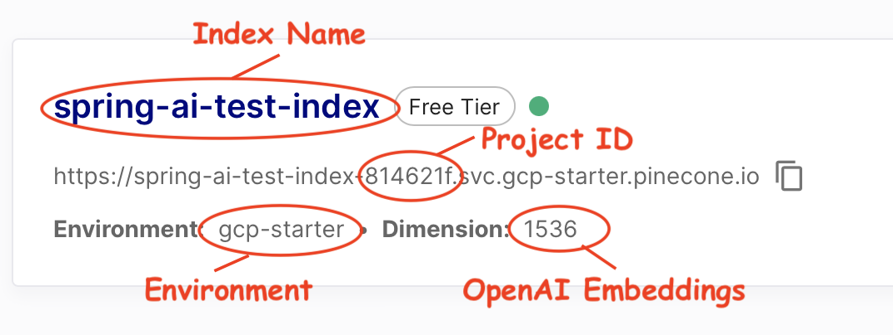

# Pinecone VectorStore

[Pinecone](https://www.pinecone.io/) is a popular cloud based Vector database.

You need to register with [pinecone portal](https://app.pinecone.io/) and create a new project, new index and optionally a new api-key.
Make sure the selected pinecone index dimensions matches the embedding dimensions returned by the configured `EmbeddingClient`.

Check your index information to find the configuration need to create a `PineconeVectorStore` instance:


Following snippet illustrate how to create the instance:

```java
EmbeddingClient embeddingClient = ...;

PineconeVectorStoreConfig pineconeConfig =
	PineconeVectorStoreConfig.builder()
		.withApiKey("PINECONE_API_KEY")
		.withEnvironment("PINECONE_ENVIRONMENT")
		.withProjectId("PINECONE_PROJECT_ID")
		.withIndexName("PINECONE_INDEX_NAME")
		.withNamespace("PINECONE_NAMESPACE")
		.build();

VectorStore vectorStore =
	new PineconeVectorStore(pineconeConfig, embeddingClient);
```

NOTE: You can use the free tier (gcp-starter) account, but as it doesn't support namespaces, use an empty namespace (e.g. "").